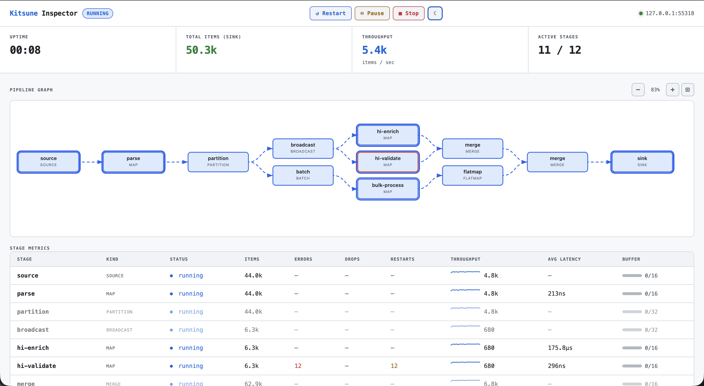

<p align="center">
  
</p>

> **Note:** This project is an AI code exploration: the codebase is partially written using AI agents as an experiment in AI-assisted software development.

Type-safe, concurrent data pipelines for Go. Compose functions into stages; channels, goroutines, backpressure, and error routing are handled for you.

```go
lines  := kitsune.FromSlice(rawLines)
parsed := kitsune.Map(lines, parse)
err    := parsed.Filter(isCritical).ForEach(notify).Run(ctx)
```

## Install

```
go get github.com/zenbaku/go-kitsune
```

## Features

- **13 M items/sec** throughput on Apple M1; stage fusion, micro-batching, and a zero-alloc fast path
- **Automatic backpressure:** bounded channels between every stage; slow consumers block upstream, nothing is dropped silently
- **Compile-time type safety:** `Pipeline[T]` carries its element type; every stage transition checked at compile time via generics
- **Per-stage concurrency:** `Concurrency(n)` spins up parallel workers; `Ordered()` preserves arrival order with a slot-based resequencer
- **Fan-out & fan-in:** `Partition`, `Broadcast`, `Share`, `Balance`, `KeyedBalance`, `Merge`, `Zip`, `LatestFrom`
- **Batching & windowing:** `Batch`, `MapBatch`, `Window`, `SlidingWindow`, `SessionWindow`, `ChunkBy`; by count, timeout, gap, or key
- **Stateful processing:** `MapWith` / `MapWithKey` with typed `Ref` per run; key-sharded concurrency gives each entity its own goroutine (in-process actor model, lock-free)
- **Error routing:** per-stage `Skip`, `Retry` (exponential backoff), `RetryThen`, `Return`, `MapResult`; errors are values, not panics
- **Circuit breaker:** configurable failure threshold, cooldown, and half-open probes; fast-fails when a dependency is unhealthy
- **Rate limiting:** token-bucket `RateLimit` with wait or drop mode; `MapWithKey` enables per-entity limits with zero mutex contention
- **Supervision & restart:** `Supervise` wraps any stage with restart-on-error or restart-on-panic, with configurable backoff
- **Stage composition:** `Stage[I,O]` is a first-class type; `Then` composes, `Or` adds a typed fallback; fragments test in isolation
- **100+ operators:** sources, transforms, filters, expansion, aggregation, time-based, enrichment, and utility operators
- **Observability:** `Hook` interface, `MetricsHook`, `LogHook` (structured `slog`), live [inspector dashboard](doc/inspector.md); OTel, Prometheus, Datadog tails
- **27 integrations:** Kafka, NATS, RabbitMQ, Postgres, Redis, S3, MongoDB, ClickHouse, SQS, Kinesis, Pub/Sub, and more via `tails/`

## When to use Kitsune

Kitsune is a good fit for **in-process data pipelines** where you want typed composition, backpressure, and concurrency control without boilerplate:

- **ETL and data processing**: read from files, APIs, or databases; transform; write to sinks
- **Fan-out workflows**: partition, broadcast, or duplicate streams with compile-time type safety
- **Concurrent enrichment**: call external services with bounded parallelism and automatic retry
- **Streaming aggregation**: batch, window, deduplicate, or cache in-flight data

Kitsune is **not** a distributed stream processor. No Kafka consumer group management, no checkpointing, no cluster coordination. For distributed processing, use a dedicated framework. Kitsune complements them: handle the in-process pipeline logic here and connect to external systems via `tails/` or your own `Generate`/`ForEach` stages.

## Quick start

```go
package main

import (
    "context"
    "fmt"
    "strconv"

    kitsune "github.com/zenbaku/go-kitsune"
)

func main() {
    input := kitsune.FromSlice([]string{"1", "2", "3", "4", "5"})
    parsed := kitsune.Map(input, kitsune.Lift(strconv.Atoi))
    doubled := kitsune.Map(parsed, func(_ context.Context, n int) (int, error) {
        return n * 2, nil
    })

    results, err := doubled.Filter(func(n int) bool { return n > 4 }).
        Collect(context.Background())
    if err != nil {
        panic(err)
    }
    fmt.Println(results) // [6 8 10]
}
```

**New to Kitsune?** The [Getting Started guide](doc/getting-started.md) covers the mental model, concurrency, error handling, branching, and testing in ~10 minutes.

## Documentation

| Guide | What's inside |
|---|---|
| [Getting Started](doc/getting-started.md) | Mental model, first pipeline, concurrency, error handling, branching, testing |
| [Operator Catalog](doc/operators.md) | Every source, transform, terminal, and option with signature and description |
| [Error Handling](doc/error-handling.md) | Per-item `OnError`, stage-level `Supervise`, evaluation order, retry-then-restart patterns |
| [Tails](doc/tails.md) | Connecting to Kafka, Redis, S3, Postgres, and 20+ external systems |
| [Inspector](doc/inspector.md) | Real-time web dashboard: pipeline DAG, per-stage metrics, stop/restart |
| [Testing](doc/testing.md) | Mocking clients, error paths, time-sensitive operators, testkit reference |
| [Tuning](doc/tuning.md) | Buffer sizing, concurrency, batching, memory trade-offs |
| [Benchmarks](doc/benchmarks.md) | Throughput numbers on Apple M1 |
| [Internals](doc/internals.md) | DAG construction, runtime compilation, concurrency models, supervision |
| [Comparison](doc/comparison.md) | vs. goroutines+channels, conc, go-streams, RxGo, Watermill, Benthos |

## Live inspector dashboard

The `inspector` sub-package serves a real-time web dashboard. Add one line to any pipeline, no other changes needed.

```
go get github.com/zenbaku/go-kitsune/inspector
```

```go
insp := inspector.New()
defer insp.Close()
fmt.Println("Inspector:", insp.URL()) // open in browser

err := valid.ForEach(store, kitsune.WithName("store")).Run(ctx, kitsune.WithHook(insp))
```



Try it: `task inspector` or `go run ./examples/inspector`. See [`doc/inspector.md`](doc/inspector.md) for the full reference.

## Tails

Tails are optional extension packages that connect pipelines to external systems. Each tail is a separate Go module: you only pull in the dependencies you use.

| Tail | Import | What |
|---|---|---|
| **kfile** | `github.com/zenbaku/go-kitsune/tails/kfile` | File, CSV, JSONL sources and sinks |
| **khttp** | `github.com/zenbaku/go-kitsune/tails/khttp` | Paginated HTTP GET source, POST/webhook sink |
| **kkafka** | `github.com/zenbaku/go-kitsune/tails/kkafka` | Kafka consumer source, producer sink |
| **kpostgres** | `github.com/zenbaku/go-kitsune/tails/kpostgres` | LISTEN/NOTIFY source, INSERT + COPY batch sink |
| **kredis** | `github.com/zenbaku/go-kitsune/tails/kredis` | Redis Store, Cache, DedupSet, list source/sink |
| **ks3** | `github.com/zenbaku/go-kitsune/tails/ks3` | S3-compatible object listing and line-streaming sources |
| **ksqlite** | `github.com/zenbaku/go-kitsune/tails/ksqlite` | SQLite query source, single/batch insert sinks |
| **kotel** | `github.com/zenbaku/go-kitsune/tails/kotel` | OpenTelemetry Hook; per-stage metrics and buffer gauges |
| **kprometheus** | `github.com/zenbaku/go-kitsune/tails/kprometheus` | Prometheus Hook; per-stage counters and duration histograms |
| **kdatadog** | `github.com/zenbaku/go-kitsune/tails/kdatadog` | Datadog DogStatsD Hook; per-stage counts and distributions |
| **knats** | `github.com/zenbaku/go-kitsune/tails/knats` | NATS core subscribe/publish + JetStream consume/publish |
| **kpubsub** | `github.com/zenbaku/go-kitsune/tails/kpubsub` | Google Cloud Pub/Sub subscribe source and publish sink |
| **ksqs** | `github.com/zenbaku/go-kitsune/tails/ksqs` | AWS SQS receive source, send sink, batch send sink |
| **kkinesis** | `github.com/zenbaku/go-kitsune/tails/kkinesis` | AWS Kinesis shard consumer source and PutRecords batch sink |
| **kdynamo** | `github.com/zenbaku/go-kitsune/tails/kdynamo` | AWS DynamoDB Scan/Query sources and BatchWriteItem sink |
| **kmongo** | `github.com/zenbaku/go-kitsune/tails/kmongo` | MongoDB Find/Watch sources and InsertMany batch sink |
| **kclickhouse** | `github.com/zenbaku/go-kitsune/tails/kclickhouse` | ClickHouse Query source and native-protocol batch Insert sink |
| **kes** | `github.com/zenbaku/go-kitsune/tails/kes` | Elasticsearch scrolling Search source and Bulk index sink |
| **kgrpc** | `github.com/zenbaku/go-kitsune/tails/kgrpc` | gRPC server-streaming source and client-streaming sink |
| **kwebsocket** | `github.com/zenbaku/go-kitsune/tails/kwebsocket` | WebSocket frame Read source and Write sink |
| **kmqtt** | `github.com/zenbaku/go-kitsune/tails/kmqtt` | MQTT Subscribe source and Publish sink |
| **kpulsar** | `github.com/zenbaku/go-kitsune/tails/kpulsar` | Apache Pulsar consumer source and producer sink |

All tails follow the **user-managed connections** principle: you create, configure, and close clients yourself. Kitsune never opens or closes connections.

See the [Tails Guide](doc/tails.md) for per-tail configuration, usage patterns, and examples.

## Examples

The [`examples/`](examples/) directory contains standalone programs. Run any with `go run ./examples/<name>`.

| Example | What it covers |
|---|---|
| `basic` | FromSlice, Map, Lift, ForEach |
| `filter` | Filter, Tap, Take, Drain |
| `batch` | Batch, Unbatch, BatchTimeout |
| `concurrent` | Concurrency, Ordered, LogHook |
| `errors` | Skip, Retry, RetryThen, StageError |
| `fanout` | Partition, MergeRunners |
| `broadcast` | Broadcast to multiple downstream runners |
| `stages` | Stage[I,O], Then: composable, testable fragments |
| `channel` | NewChannel, RunAsync: push-based source |
| `state` | MapWith, FlatMapWith, Ref |
| `supervise` | Supervise, RestartOnError, RestartOnPanic |
| `inspector` | Live web dashboard with full branching topology |
| `streams` | Unfold, Iterate, Repeatedly, Cycle, Concat |
| `transform` | Reject, WithIndex, Intersperse, TakeEvery |
| `reshape` | ChunkBy, ChunkWhile, Sort, SortBy, Unzip |
| `aggregate` | Sum, Min, Max, Frequencies, ReduceWhile, TakeRandom |
| `enrich` | MapBatch, LookupBy, Enrich |
| `dedupe` | Dedupe, Distinct, CacheBy |
| `timeout` | Timeout StageOption: per-item deadline |
| `ticker` | Ticker, Timer: scheduled sources |
| `pairwise` | Pairwise, SlidingWindow |
| `concatmap` | ConcatMap vs FlatMap: ordered sequential expansion |
| `mapresult` | MapResult: route errors to a separate pipeline |
| `latestfrom` | LatestFrom: combine stream with latest secondary value |
| `zipwith` | ZipWith: combine two branches into a custom type |

Six additional examples live in their own modules (they import tail packages):

```
examples/files      — kfile CSV/JSONL sources and sinks
examples/redis      — kredis list source, Redis-backed Store and Cache
examples/sqlite     — ksqlite query source, batch insert sink
examples/http       — HTTP pagination source with retry
examples/prometheus — kprometheus hook: per-stage counters, histograms
examples/websocket  — kwebsocket: Read source and Write sink
```

## License

MIT
