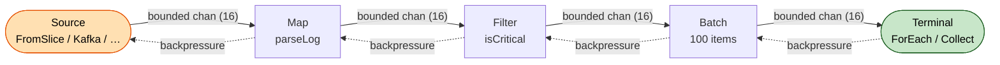

# Getting Started with Kitsune

This guide takes you from zero to a working pipeline in about 10 minutes. It covers the mental model, the key patterns you'll use daily, and where to go next.

---

## :material-head-lightbulb-outline: Mental model

A Kitsune pipeline is a **directed acyclic graph (DAG)** of processing stages. You assemble it by calling functions: no goroutines start, no channels are allocated. Everything is lazy. When you call `Run` (or [`Collect`](operators.md#collect-first-last-count-any-all-find-contains), or [`First`](operators.md#collect-first-last-count-any-all-find-contains)), the runtime:

1. validates the graph
2. allocates bounded channels between every pair of stages
3. launches one goroutine per stage inside an errgroup
4. runs until the source is exhausted, the context is cancelled, or a stage returns an unhandled error

**Backpressure is automatic.** Each inter-stage channel has a bounded buffer (16 by default). A slow downstream stage blocks the upstream stage rather than allowing unbounded queuing.



Solid arrows show item flow; dashed arrows show backpressure propagating upstream when a downstream stage is slow.

**Context propagates everywhere.** Cancelling the context stops all stages cleanly.

### Vertical style, not fluent chains

Go's type system requires a specific code style. **Methods** preserve the element type and can be chained. **Free functions** change the type and must be assigned to a new variable:

```go
lines    := kitsune.FromSlice(rawLines)     // *Pipeline[string]
parsed   := kitsune.Map(lines, parseLog)    // *Pipeline[LogEntry]   (type changed: free function)
critical := parsed.Filter(isCritical)       // *Pipeline[LogEntry]   (type preserved: method)
batched  := kitsune.Batch(critical, kitsune.BatchCount(100))    // *Pipeline[[]LogEntry]; type changed: free function
_, err   := batched.ForEach(store).Run(ctx)
```

This is a Go language constraint: methods cannot introduce new type parameters. But the style is an asset: each variable name documents what's flowing, and the compiler checks every type transition.

**Rule of thumb:**
- **Free functions** (type may change, or extra type parameters required): [`Map`](operators.md#map), [`FlatMap`](operators.md#flatmap), [`Batch`](operators.md#batch), [`Unbatch`](operators.md#unbatch), [`MapWith`](operators.md#mapwith), [`FlatMapWith`](operators.md#flatmapwith), [`Reject`](operators.md#reject), [`ChunkBy`](operators.md#chunkby), [`Sort`](operators.md#sort-sortby), [`SortBy`](operators.md#sort-sortby), [`ZipWith`](operators.md#zip-zipwith), [`Unzip`](operators.md#unzip), [`Enrich`](operators.md#enrich), …
- **Methods** (type-preserving, no extra type parameters): [`.Filter`](operators.md#filter), [`.Tap`](operators.md#tap-taperror-finally), [`.Take`](operators.md#take), `.Skip`, [`.Through`](operators.md#stagei-o-then-through-or), [`.ForEach`](operators.md#foreach), [`.Drain`](operators.md#drain)

Not every operator fits neatly. `Reject` keeps the type but is a free function because the method form would be ambiguous with complex generics. When in doubt, look for it in both places; the [operator catalog](operators.md) lists every operator with its exact call form.

---

## :material-pipe: Your first pipeline

```go
package main

import (
    "context"
    "fmt"
    "strconv"

    kitsune "github.com/zenbaku/go-kitsune"
)

func main() {
    // Source: emit each string from a slice
    input := kitsune.FromSlice([]string{"1", "2", "3", "4", "5"})

    // Transform: parse each string to int
    // kitsune.LiftFallible wraps a context-free func(I)(O,error) for use with Map
    parsed := kitsune.Map(input, kitsune.LiftFallible(strconv.Atoi))

    // Terminal: collect all results into a slice
    results, err := parsed.Filter(func(n int) bool { return n > 2 }).
        Collect(context.Background())
    if err != nil {
        panic(err)
    }
    fmt.Println(results) // [3 4 5]
}
```

[`FromSlice`](operators.md#fromslice) + [`Collect`](operators.md#collect-first-last-count-any-all-find-contains) is the testing pattern too: deterministic, no goroutines, no infrastructure. See the [`basic` example](examples.md#basic) for the runnable version.

---

## :material-export: Consuming output with [`Iter`](operators.md#iter)

[`Collect`](operators.md#collect-first-last-count-any-all-find-contains) is the right terminal when you need the full result set: a test assertion, a bulk insert, or building a response. But sometimes you want to process items one-by-one as they arrive, without buffering the whole stream. That's what [`Iter`](operators.md#iter) is for.

[`Iter`](operators.md#iter) returns two values: an `iter.Seq[T]` for use with `range`, and an error function to call once the loop finishes:

```go
seq, errFn := kitsune.Map(events, enrich, kitsune.Concurrency(20)).Iter(ctx)
for event := range seq {
    fmt.Println(event)
}
if err := errFn(); err != nil {
    log.Fatal(err)
}
```

The pipeline starts in the background as soon as `Iter` is called. Items flow from the pipeline into the `for range` loop through a buffered channel; the loop blocks when the pipeline hasn't produced anything yet, and the pipeline backs off when the consumer is too slow.

**The error function must always be called**: it blocks until the pipeline finishes and reports any stage error. Think of it like `rows.Close()` or `resp.Body.Close()`: forgetting it leaks resources.

### Breaking out early

If you only need the first few results, `break` as usual. Kitsune detects the break, cancels the pipeline, and drains any in-flight items. The error function returns `nil`: the `context.Canceled` caused by the break is suppressed, since it was expected:

```go
seq, errFn := kitsune.FromIter(infiniteStream).Iter(ctx)
var first []Event
for e := range seq {
    first = append(first, e)
    if len(first) == 10 {
        break // pipeline is cancelled; resources are freed
    }
}
if err := errFn(); err != nil { // nil; break-induced cancellation is suppressed
    log.Fatal(err)
}
```

If the *caller's own context* is cancelled (timeout, shutdown signal), `errFn` returns `context.Canceled` as normal, only the break-path suppresses it.

### When to use `Iter` vs `Collect`

| | [`Iter`](operators.md#iter) | [`Collect`](operators.md#collect-first-last-count-any-all-find-contains) |
|---|---|---|
| Output size | Unbounded or large | Bounded, fits in memory |
| Processing | Item-by-item as they arrive | After all items are in hand |
| Early exit | Natural with `break` | Use [`.Take(n)`](operators.md#take) then `Collect` |
| Composability | Works with `slices.Collect`, `maps.Collect`, any `iter.Seq[T]` consumer | Returns `[]T` directly |

For the common case of "run the whole pipeline and give me a slice", [`Collect`](operators.md#collect-first-last-count-any-all-find-contains) is more concise. Reach for [`Iter`](operators.md#iter) when streaming, when memory matters, or when you want to feed pipeline output directly into another `iter.Seq[T]`-based API.

---

## :material-pause-circle-outline: Pausing and resuming a pipeline

Sometimes you need to temporarily stop a pipeline without cancelling it, for example, during a maintenance window, when a downstream system signals it's overloaded, or to implement rate-adaptive ingestion. `Pause` and `Resume` handle this without tearing down the pipeline or losing in-flight work.

[`RunAsync`](operators.md#runner-runasync) automatically creates a `Gate` and exposes it on the returned `RunHandle`:

```go
h := pipeline.ForEach(store).RunAsync(ctx)

// Later, from any goroutine:
h.Pause()  // sources stop emitting; in-flight items continue draining
h.Resume() // sources start again
```

While paused, sources block before sending each item into the pipeline. Downstream stages, [`Map`](operators.md#map), [`Filter`](operators.md#filter), [`Batch`](operators.md#batch), sinks, continue running and drain whatever is already in-flight. No items are dropped and no goroutines exit.

### Checking pause state

```go
if h.Paused() {
    log.Println("pipeline is paused")
}
```

### External gate for synchronous Run

`RunHandle` requires [`RunAsync`](operators.md#runner-runasync). To pause a pipeline running under the blocking `Runner.Run`, create a `Gate` externally and attach it with `WithPauseGate`:

```go
gate := kitsune.NewGate()

go func() {
    time.Sleep(5 * time.Second)
    gate.Pause()
    performMaintenance()
    gate.Resume()
}()

// Blocking run, pauseable from the goroutine above.
if _, err := runner.Run(ctx, kitsune.WithPauseGate(gate)); err != nil {
    log.Fatal(err)
}
```

### Cancellation while paused

Cancelling the context while the pipeline is paused unblocks sources immediately and shuts the pipeline down cleanly. Pause does not interfere with shutdown.

### When not to use pause

Pause is a coarse control: it stops all sources simultaneously. For fine-grained flow control on a single stage, use [`RateLimit`](operators.md#ratelimit) or the `Overflow(DropOldest)` buffer strategy instead. For stopping the pipeline entirely, cancel the context.

See the [`pause` example](examples.md#pause) for a runnable version.

---

## :material-lightning-bolt-outline: Adding concurrency

Stage functions receive a `context.Context` as their first argument:

```go
func enrichUser(ctx context.Context, id string) (User, error) {
    return db.GetUser(ctx, id) // real I/O
}
```

To run multiple requests in parallel, add `Concurrency(n)`:

=== "Unordered (default)"

    ```go
    users := kitsune.Map(ids, enrichUser, kitsune.Concurrency(20))
    ```

=== "Ordered"

    ```go
    users := kitsune.Map(ids, enrichUser, kitsune.Concurrency(20), kitsune.Ordered())
    ```

This starts 20 goroutines that all read from the same input channel. **Output order is not preserved** by default; goroutines finish in whatever order the I/O completes. `Ordered()` uses a slot-based resequencer: workers still run in parallel, but results are emitted in arrival order.

**Starting point**: 10–20 for HTTP or database calls; `runtime.NumCPU()` for CPU-bound work.

See the [`concurrent` example](examples.md#concurrent) for a runnable version with `LogHook`.

---

## :material-alert-circle-outline: Error handling

Every stage function returns `(O, error)`. By default, any error halts the entire pipeline (context cancelled, `Run` returns the error). You can change this per stage with `OnError`:

=== "Skip on error"

    ```go
    parsed := kitsune.Map(lines, parseLine,
        kitsune.OnError(kitsune.Skip()),
    )
    ```

=== "Retry with backoff"

    ```go
    results := kitsune.Map(queries, callAPI,
        kitsune.Concurrency(10),
        kitsune.OnError(kitsune.RetryMax(3, kitsune.ExponentialBackoff(time.Second, 30*time.Second))),
    )
    ```

=== "Retry then skip"

    ```go
    results := kitsune.Map(queries, callAPI,
        kitsune.OnError(kitsune.RetryThen(3,
            kitsune.ExponentialBackoff(time.Second, 30*time.Second),
            kitsune.Skip(),
        )),
    )
    ```

For more advanced routing: send failures to a dead-letter queue instead of discarding them. Use [`MapResult`](operators.md#mapresult), wrapping `transform` with your own retry loop if you need transient-failure handling first:

```go
// MapResult routes errored items to a second pipeline as ErrItem[Input].
ok, dlq := kitsune.MapResult(items, transform)
// ok  is *Pipeline[Output]
// dlq is *Pipeline[ErrItem[Input]]
```

When `Runner.Run` returns an error, it is wrapped in a `kitsune.StageError` carrying the stage name, attempt count, and original cause:

```go
if _, err := runner.Run(ctx); err != nil {
    var se *kitsune.StageError
    if errors.As(err, &se) {
        fmt.Printf("stage %q failed on attempt %d: %v\n", se.Stage, se.Attempt, se.Cause)
    }
}
```

See the [examples directory](https://github.com/zenbaku/go-kitsune/tree/main/examples) for more.

---

## :material-source-branch: Branching: fan-out and fan-in

**[`Partition`](operators.md#partition)** routes each item to one of two outputs based on a predicate:

```go
orders := kitsune.FromSlice(allOrders)
high, regular := kitsune.Partition(orders, func(o Order) bool { return o.Amount >= 100 })

vip := kitsune.Map(high, priorityProcess).ForEach(notifyVIP)
std := kitsune.Map(regular, standardProcess).ForEach(store)

// MergeRunners runs both branches, blocks until both complete
merged, err := kitsune.MergeRunners(vip, std)
if err != nil { /* handle */ }
_, err = merged.Run(ctx)
```

**[`Broadcast`](operators.md#broadcast-broadcastn)** copies every item to all N output pipelines (unlike [`Partition`](operators.md#partition), where each item goes to exactly one):

```go
original, audit := kitsune.Broadcast(events, 2)
```

**[`Merge`](operators.md#merge)** fans multiple same-type pipelines back into one:

```go
combined := kitsune.Merge(stream1, stream2, stream3)
```

See the [`fanout`](examples.md#fanout) and [`broadcast`](examples.md#broadcast) examples.

---

## :material-test-tube: Testing pipelines

Because pipelines are assembled lazily, you can test any fragment in isolation:

```go
func TestParseLine(t *testing.T) {
    input  := kitsune.FromSlice([]string{"INFO: started", "WARN: slow", "ERROR: failed"})
    result := kitsune.Map(input, parseLine, kitsune.OnError(kitsune.Skip()))

    entries, err := result.Collect(context.Background())
    require.NoError(t, err)
    require.Len(t, entries, 3)
    assert.Equal(t, "ERROR", entries[2].Level)
}
```

[`FromSlice`](operators.md#fromslice) + [`Collect`](operators.md#collect-first-last-count-any-all-find-contains) is the core test pattern: no goroutines to manage, no ports to open, fully deterministic output.

The `kitsune/testkit` package wraps this pattern with assertion helpers:

```go
import "github.com/zenbaku/go-kitsune/testkit"

testkit.CollectAndExpect(t, p, []int{2, 4, 6})
testkit.CollectAndExpectUnordered(t, p, []int{6, 2, 4})
got := testkit.MustCollect(t, p) // fails the test on error

// Inspect lifecycle events:
hook := &testkit.RecordingHook{}
runner.Run(ctx, kitsune.WithHook(hook))
hook.Errors()   // items that produced errors
hook.Restarts() // supervision restart events
```

For reusable pipeline fragments, define them as `Stage[I,O]` values and test each independently:

```go
var ParseStage  kitsune.Stage[string, Event]   = func(p *kitsune.Pipeline[string]) *kitsune.Pipeline[Event] { ... }
var EnrichStage kitsune.Stage[Event, Enriched] = func(p *kitsune.Pipeline[Event]) *kitsune.Pipeline[Enriched] { ... }

// Compose for production
var Pipeline = kitsune.Then(ParseStage, EnrichStage)

// Test each stage independently
events, _   := ParseStage.Apply(kitsune.FromSlice(testLines)).Collect(ctx)
enriched, _ := EnrichStage.Apply(kitsune.FromSlice(events)).Collect(ctx)
```

See the [`stages` example](examples.md#stages) for the full stage composition and testing pattern.

---

### Higher-level authoring

For larger pipelines: name groups of operators with [`Segment`](operators.md#segment), model side effects with [`Effect`](operators.md#effect), use the [`RunSummary`](operators.md#run-summary) returned from `Run` to derive structured outcomes, and iterate on downstream segments without re-running upstream work via [`WithDevStore`](operators.md#devstore).

---

## :material-map-marker-path: Where to go next

**Reference:**
- [Operator catalog](operators.md): every operator with signature and description
- [Testing guide](testing.md): mocking clients, error paths, time-sensitive operators, and testkit reference
- [Tuning guide](tuning.md): buffer sizing, concurrency, batching, memory trade-offs
- [Benchmarks](benchmarks.md): throughput numbers on Apple M1

**Deeper understanding:**
- [Internals](internals.md): DAG construction, runtime compilation, concurrency models, supervision, graceful drain

**External systems:**
- [Tails](tails.md): connecting to Kafka, Redis, S3, Postgres, and 18 more systems

**Live observability:**
- [Inspector](inspector.md): real-time web dashboard for running pipelines

**Runnable examples:** see the [Examples page](examples.md) for all 20 examples with full source and Go Playground links.
