# Kitsune Internals

This document explains how Kitsune works under the hood — the data structures,
concurrency model, and runtime machinery that powers every pipeline. It is
aimed at contributors and at users who want a mental model deeper than the
public API.

---

## The big picture

A Kitsune pipeline is a **directed acyclic graph (DAG)** of processing stages.
That graph is assembled lazily during pipeline construction — no goroutines
start, no channels are allocated — and then materialised at a single point when
`Run` (or `Collect`) is called.

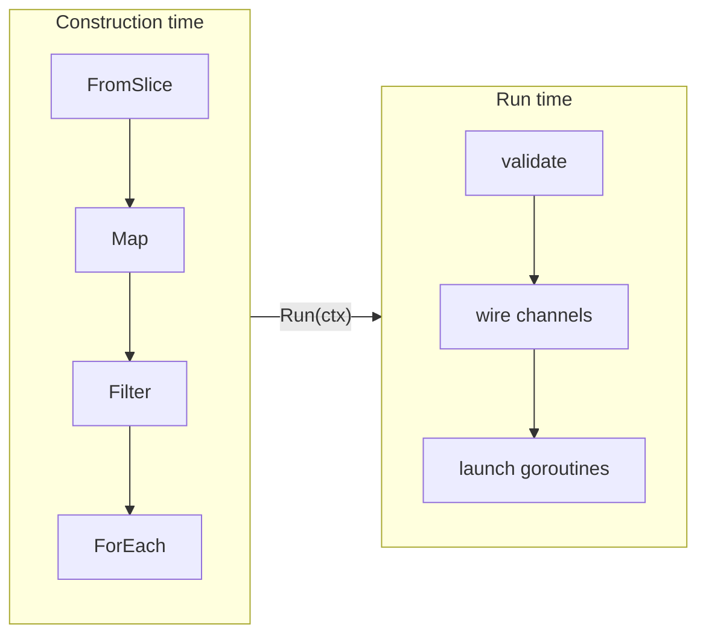

The public `kitsune` package is a thin generic wrapper. All values flow through
the runtime as `any`; generics only exist at the API boundary — erased to
concrete types on entry and restored via type assertion on exit.

---

## The Graph and Node

```
internal/engine/graph.go
```

**`Graph`** is a thread-safe, append-only list of `*Node` values. It is created
once per pipeline (by the first source call) and shared by reference through
every `*Pipeline[T]` handle derived from it. The mutex only protects `AddNode`
during construction; at run time the graph is read-only.

**`Node`** is the central configuration record for one stage:

```go
Node {
    ID           int              // position in g.Nodes; also the channel key namespace
    Kind         NodeKind         // dispatch key — see the full list below
    Name         string           // optional label used in hooks, logs, metrics
    Fn           any              // type-erased processing function

    Inputs       []InputRef       // upstream (node, port) pairs this stage reads from
    Concurrency  int              // parallel workers (default 1)
    Ordered      bool             // preserve input order when Concurrency > 1
    Buffer       int              // output channel capacity (default 16)
    Overflow     int              // 0=Block, 1=DropNewest, 2=DropOldest
    ErrorHandler ErrorHandler     // retry / skip / halt policy
    Supervision  SupervisionPolicy

    // Kind-specific fields — only the relevant ones are set per node:
    BatchSize         int
    BatchTimeout      int64           // nanoseconds
    BatchConvert      func([]any) any
    TakeN             int
    BroadcastN        int
    ZipConvert        func(any, any) any  // also used by WithLatestFrom
    ThrottleDuration  int64           // nanoseconds; shared by Throttle and Debounce
    ReduceSeed        any             // initial accumulator for Reduce
    CacheWrapFn       func(defaultCache any, defaultTTL time.Duration) any
    MapResultErrWrap  func(input any, err error) any
}
```

An `InputRef` is `{Node int, Port int}` — a pointer to one output port of an
upstream node. `Port` is almost always 0; the exceptions are multi-output nodes
(`Partition`, `MapResultNode`) and multi-input nodes (`Zip`, `WithLatestFrom`,
`Merge`).

`ChannelKey` pairs a node ID with a port number and is the map key used for
both the channel map and the outbox map built at run time.

### NodeKind reference

| Kind | Stage function | Outputs |
|---|---|---|
| `Source` | `runSource` | 1 port |
| `Map` | `runMap` → `runMapSingle` / `runMapConcurrent` / `runMapConcurrentOrdered` | 1 port |
| `FlatMap` | `runFlatMap` → same variants | 1 port |
| `Filter` | `runFilter` | 1 port |
| `Tap` | `runTap` | 1 port |
| `Take` | `runTake` | 1 port |
| `TakeWhile` | `runTakeWhile` | 1 port |
| `Batch` | `runBatch` | 1 port |
| `ReduceNode` | `runReduce` | 1 port (emits once on close) |
| `ThrottleNode` | `runThrottle` | 1 port |
| `DebounceNode` | `runDebounce` | 1 port |
| `Partition` | `runPartition` | 2 ports (match / rest) |
| `MapResultNode` | `runMapResult` | 2 ports (ok / error) |
| `BroadcastNode` | `runBroadcast` | N ports |
| `Merge` | `runMerge` | 1 port |
| `ZipNode` | `runZip` | 1 port |
| `WithLatestFromNode` | `runWithLatestFrom` | 1 port |
| `Sink` | `runSink` | 0 ports (terminal) |

---

## Channel wiring

```
internal/engine/compile.go: CreateChannels, CreateOutboxes
```

At the start of `Run`, `CreateChannels` allocates one `chan any` per output
port of every non-sink node. The result is a `map[ChannelKey]chan any`.

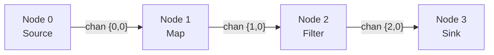

Multi-output nodes allocate one channel per port:

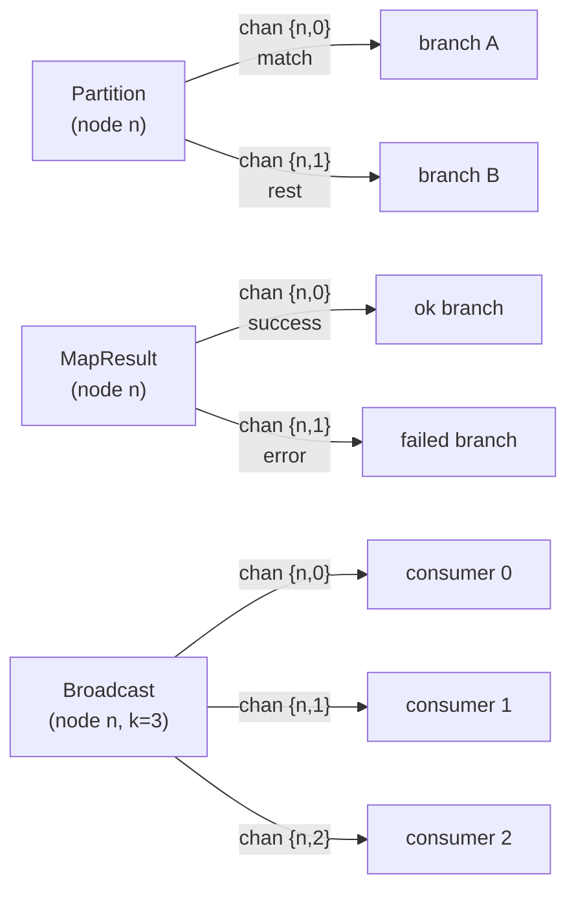

`CreateOutboxes` then wraps each raw channel in an `Outbox` that enforces the
overflow strategy configured on that node (see next section).

---

## Outboxes and overflow

```
internal/engine/outbox.go
```

Every stage writes to its output through an `Outbox`, never to the raw channel
directly. The `Outbox` interface has two methods:

```go
Send(ctx context.Context, item any) error
Dropped() int64
```

This indirection is where the three overflow strategies diverge:

**Block (default)** — a simple `select` that sends the item or returns
`ctx.Err()` on cancellation. Zero overhead; no counters.

**DropNewest** — a non-blocking try-send. If the buffer is full the incoming
item is discarded immediately. An atomic counter records the drop and
`OverflowHook.OnDrop` is called if the hook implements it. No locks.

**DropOldest** — evicts the oldest buffered item to make room. The fast path
(buffer has space) is identical to Block. The slow path (buffer full) takes a
mutex, reads one item from the channel to free a slot, then writes the new item.
The mutex is held only during that eviction, so normal sends remain
contention-free.

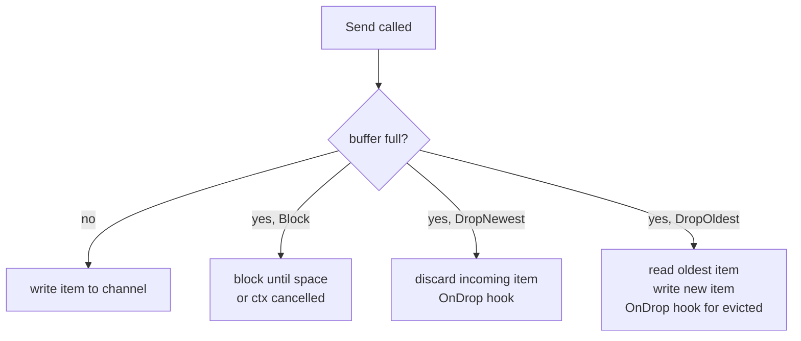

---

## How Run ties it all together

```
internal/engine/run.go: Run
```

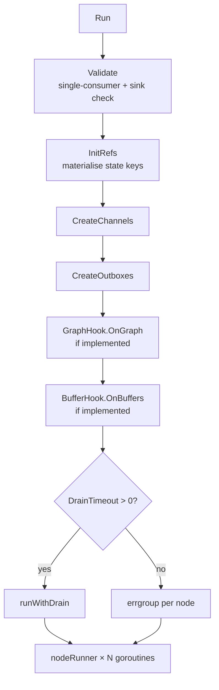

Each stage runs in its own goroutine inside an `errgroup`. When any goroutine
returns a non-nil error the group's shared context (`egCtx`) is cancelled,
causing every other goroutine to see `ctx.Done()` on its next check and exit.

**`nodeRunner`** is a closure factory that does three things before returning
the `func() error` given to the errgroup:

1. Resolves the node's input channels from the channel map.
2. Builds an `outCloser` that closes the node's output channel(s) when the stage exits —
   this is how downstream stages learn the stream is exhausted (`ok == false`).
3. Selects the right `runXxx` function and wraps it in `supervise`.

```go
nodeRunner returns func() error {
    defer outCloser()            // closes output channel(s) on exit
    return supervise(ctx, policy, hook, name, inner)
}
```

---

## The done channel: early exit without context cancellation

When `Take` or `TakeWhile` decides no more items are needed, it must signal
upstream sources to stop. Cancelling the shared context would prematurely abort
downstream stages that are still draining in-flight items.

Instead, a separate `done chan struct{}` (closed via a `sync.Once`) is used.
Sources check it on every yield:

```go
select {
case <-done:      return false  // stop producing — clean exit
case <-ctx.Done(): return false
default:
}
```

`runSource` goes a step further: it derives a `srcCtx` from the parent context
that is *also* cancelled when `done` fires, so source functions that block on
`<-ctx.Done()` (e.g. infinite generators) wake up correctly:

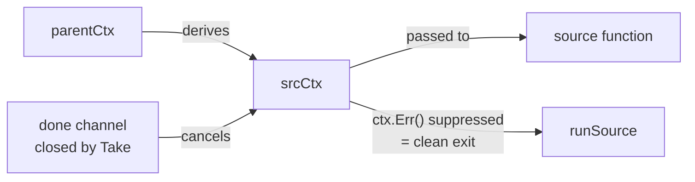

This means sources never need to know about `done` directly — they only see a
context that happens to cancel when the pipeline no longer needs them.

---

## Concurrency patterns inside a stage

### Single worker (default)

The inner loop is a straightforward `for { select { case item := <-inCh: … } }`.
No synchronisation beyond the channel itself.

### Concurrent unordered — `Concurrency(n)`

`runMapConcurrent` spawns `n` worker goroutines that all read from the same
input channel. The channel is Go's natural work queue — no extra synchronisation
needed for item distribution.

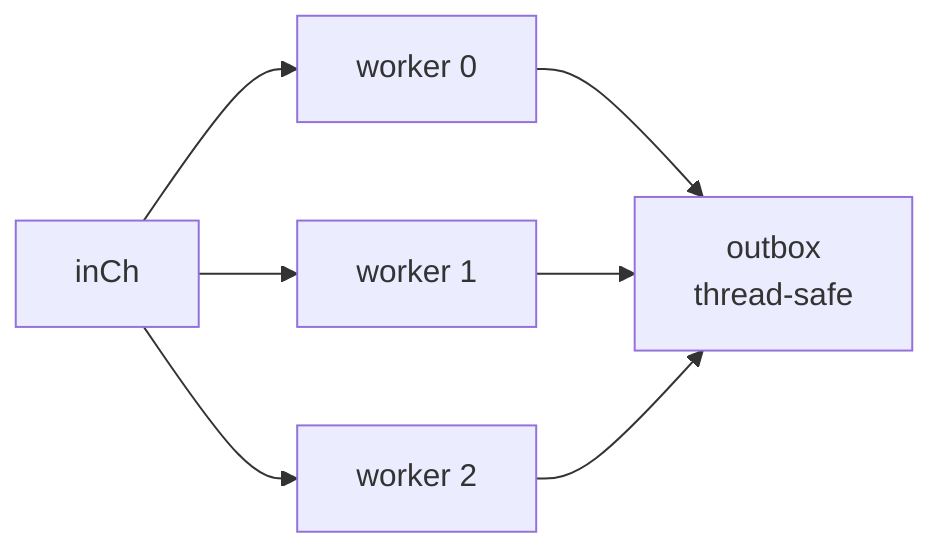

Error coordination uses an `errOnce`/`firstErr`/`innerCancel` triple: the first
worker to hit an error atomically records it, calls `innerCancel()` to stop
the others, and a `sync.WaitGroup` ensures the caller waits for all workers
before returning the error.

### Concurrent ordered — `Concurrency(n)` + `Ordered()`

`runMapConcurrentOrdered` preserves input order using a slot pipeline:

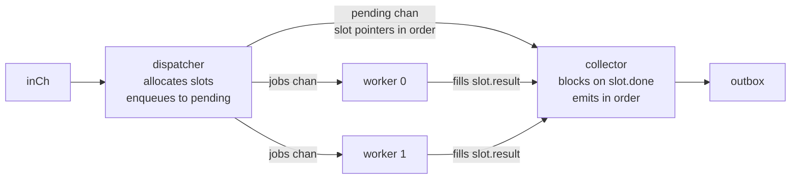

A *slot* is `{result any; err error; done chan struct{}}`. The dispatcher
creates one slot per item, sends the slot pointer to both `jobs` (for a worker
to fill) and `pending` (to maintain order). Workers run concurrently; the
collector always drains `pending` in arrival order, blocking on `<-slot.done`
before forwarding each result.

---

## Fan-out: Partition, MapResult, and Broadcast

**`runPartition`** evaluates a boolean predicate and routes each item to one
of two outboxes. Every item goes to exactly one branch (port 0 = true, port
1 = false).

**`runMapResult`** applies a transformation function and routes based on whether
it succeeded. Successful outputs go to port 0; items where the function returns
an error go to port 1, wrapped in an `ErrItem{Item, Err}` by the
`MapResultErrWrap` function stored on the node. Unlike regular `Map`, it never
invokes the `ErrorHandler` — every error is always routed, never halted or
retried.

Both `Partition` and `MapResultNode` follow the same two-port pattern in the
compiler (`CreateChannels`, `CreateOutboxes`) and are treated identically in
the `BufferHook` buffer-query closure.

**`runBroadcast`** sends every item to all N outboxes sequentially. Because the
sends are sequential, a slow consumer on one branch will backpressure the entire
broadcast. Size buffers generously on broadcast branches when consumers run at
different speeds.

All fan-out nodes close all of their output channels on exit, cascading
shutdown down every branch.

---

## Fan-in: Merge and Zip

**`runMerge`** spawns one goroutine per input channel. All goroutines write to
the same shared outbox:

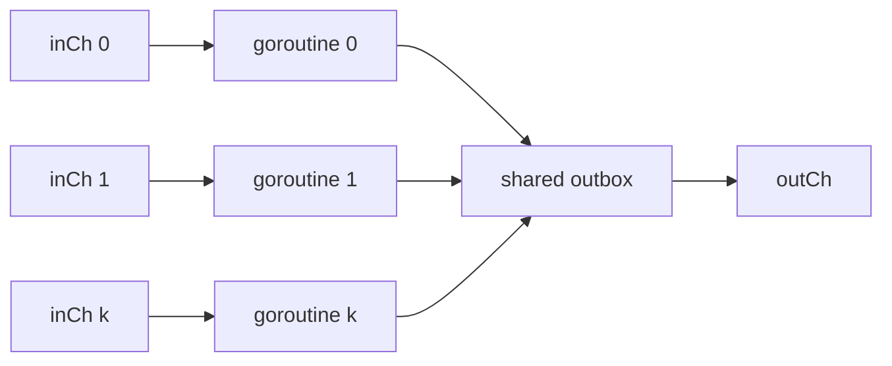

The output channel is closed once all input goroutines have exited. Errors use
the same `errOnce`/`innerCancel` coordination as concurrent map.

**`runZip`** reads from two input channels *sequentially*, not concurrently:

```go
for {
    a, ok := <-inCh1   // blocks until item or close
    b, ok := <-inCh2   // then blocks for the partner
    outbox.Send(ctx, convert(a, b))
}
```

The sequential read means: if `inCh1` is producing faster than `inCh2`, items
accumulate in `inCh1`'s buffer while `runZip` waits for `inCh2`. Buffer the
faster branch generously (`Buffer` option) when the two sources run at different
rates.

---

## WithLatestFrom

`runWithLatestFrom` maintains a mutex-protected "latest secondary value" that is
updated by a background goroutine, while the main loop combines primary items
with that value:

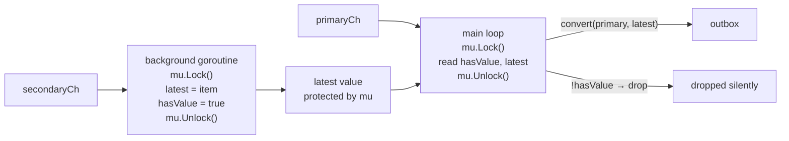

Primary items that arrive before the secondary has emitted a single value are
silently dropped — this matches RxJS semantics. The background goroutine exits
when `secondaryCh` is closed or `ctx` is cancelled.

**Independent-graph support**: `WithLatestFrom` (like `Merge` and `Zip`) works
with pipelines from separate graphs. When the two pipelines share a graph the
engine-native node is used; otherwise the secondary pipeline drains into a
mutex-protected `latest` value in a background goroutine while the primary is
forwarded through a channel — mirroring the engine implementation but at the
`Generate` layer. The `Partition` pattern is still useful when config updates
and primary events are multiplexed into the same source channel:

```go
cfgBranch, reqBranch := kitsune.Partition(src.Source(), func(e Event) bool {
    return e.IsConfig
})
combined := kitsune.WithLatestFrom(reqBranch, cfgBranch)
```

---

## Time-based stages: Throttle and Debounce

Both stages store their duration in `Node.ThrottleDuration` (nanoseconds,
cast at run time to `time.Duration`).

**`runThrottle`** records the `lastEmit` timestamp. Each incoming item is
compared against the elapsed time: if `now - lastEmit >= d`, the item is emitted
and `lastEmit` is updated; otherwise the item is dropped. Items dropped this way
trigger `OverflowHook.OnDrop`.

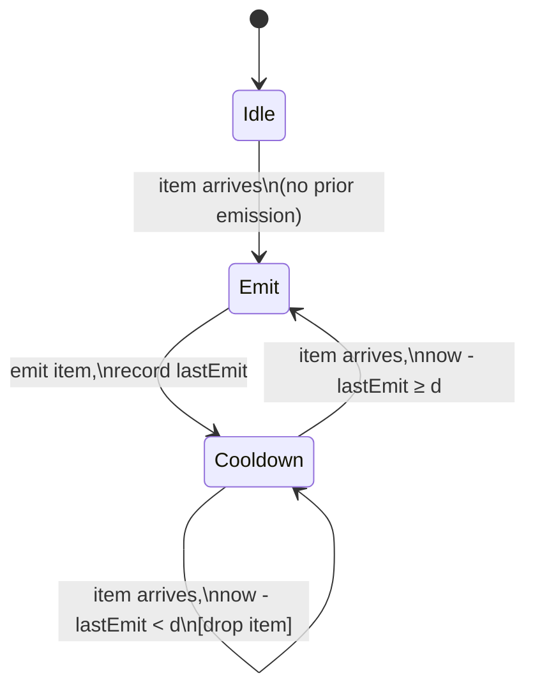

**`runDebounce`** keeps a single `pending` slot and a resettable `time.Timer`.
Each incoming item replaces `pending` and resets the timer. When the timer fires
with no new arrivals, `pending` is emitted. On input close, any remaining
`pending` item is flushed immediately.

The timer management is careful to drain `timer.C` after a `Stop()` that may
have already fired — a standard Go timer-reset pattern to avoid receiving a
stale tick on the next `select`.

---

## Reduce and Scan

**`runReduce`** accumulates into a single value using `Node.ReduceSeed` as the
initial accumulator. It does *not* emit on every item; it only emits when the
input channel closes:

```go
acc := n.ReduceSeed
for item := range inCh { acc = fn(acc, item) }
outbox.Send(ctx, acc)  // emits once
```

This means `Reduce` always emits exactly one value — even on an empty stream
(it emits the seed).

**Scan** is implemented at the kitsune layer as a `Map` with a closure that
closes over an accumulator variable. It emits after *every* item rather than
waiting for close, so it is purely an operator-layer concept with no special
engine support.

---

## Batching

`runBatch` accumulates items in a `[]any` slice and flushes when either the
size limit is reached or a timeout fires.

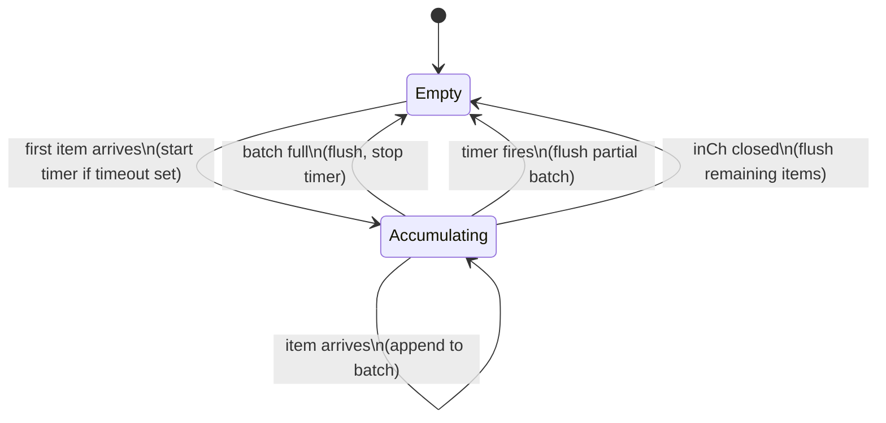

The timer is **off** when the batch is empty, **started** on the first item,
and **reset** after each flush. This ensures a partial batch always drains
within `timeout` of its first item regardless of upstream throughput.

The final flush on channel close is what makes graceful drain work for batch
stages: once upstream sources stop and their channels close, any partial batch
is emitted rather than silently discarded.

---

## Cache integration

When a `Map` stage uses `CacheBy`, the construction-time code sets
`Node.CacheWrapFn` — a factory that produces a cache-wrapped replacement for
`Node.Fn`. The factory is not called at construction time; it is deferred to
run time so it can receive runner-level defaults (`WithCache`).

At run time, `nodeRunner` calls `resolveCacheWrap` before dispatching:

```go
func resolveCacheWrap(n *Node, cfg RunConfig) *Node {
    if n.CacheWrapFn == nil { return n }
    wrapped := n.CacheWrapFn(cfg.DefaultCache, cfg.DefaultCacheTTL)
    cp := *n           // shallow copy — do not mutate the shared graph
    cp.Fn = wrapped
    return &cp
}
```

The shallow copy is critical: the graph is shared across repeated `Run` calls,
so mutating `n.Fn` in place would corrupt subsequent runs.

The `Timeout` StageOption wraps `Fn` at *construction* time (before
`CacheWrapFn` is built), ensuring both the direct call path and any cache-miss
path get the per-item deadline:

```
construction time:   fn → timeout-wrapped fn → CacheWrapFn factory (closes over it)
run time:            resolveCacheWrap invokes factory → cache-wrapped fn
                     cache miss path calls the timeout-wrapped inner fn
```

---

## State management

`Graph` carries two maps for pipeline-level state:

- **`KeyInits`**: `map[string]func(store any) any` — registered at construction
  time by `NewKey`. Associates a key name with a factory that creates a `*Ref[T]`
  given the store backend.
- **`Refs`**: `map[string]any` — populated at run time by `InitRefs`. Each
  factory is called once, producing the concrete `*Ref[T]` that stages share.

Stage functions that use `MapWith`/`FlatMapWith` close over `g.GetRef(name)` —
they receive the materialised ref from `Refs`, not the factory. This means the
same stage definition can be run against different store backends simply by
passing a different `WithStore(s)` run option.

---

## Supervision

```
internal/engine/supervise.go
```

`supervise` is a **zero-cost abstraction** when inactive
(`MaxRestarts == 0 && OnPanic == PanicPropagate`): it calls the stage function
directly and returns, with no overhead.

When active, it wraps each execution in `runProtected` — a `defer recover()`
guard — and loops up to `MaxRestarts` times:

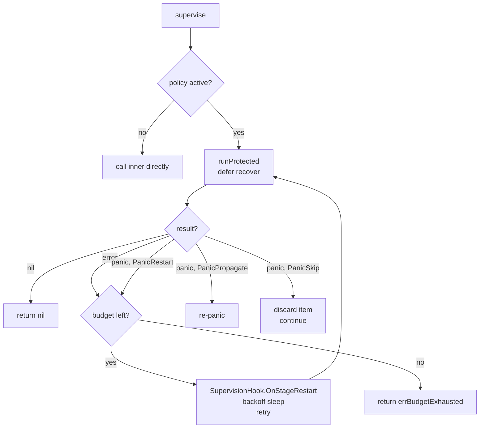

The `Window` field resets the restart counter after a quiet period, preventing
a stage with occasional hiccups from eventually exhausting its budget.

---

## Observability hooks

The hook system uses **optional interface extension** — a single base `Hook`
with several opt-in extensions checked via type assertion at run time. This
means existing `Hook` implementations never need to be updated when new
extension points are added.

| Interface | When called | Use case |
|---|---|---|
| `Hook` (base) | Stage start/stop, per-item | Metrics, logging |
| `OverflowHook` | Item dropped by overflow strategy or Throttle | Drop counters |
| `SupervisionHook` | Stage restarted after error or panic | Alerting |
| `SampleHook` | ~every 10th successful item | Value-level tracing |
| `GraphHook` | Once before execution, with full DAG snapshot | Topology export |
| `BufferHook` | Once before execution, with a channel-fill query fn | Backpressure dashboards |

**`GraphHook.OnGraph`** receives a `[]GraphNode` snapshot of the compiled graph —
node IDs, kinds, inputs, concurrency, buffer sizes. This fires before any stage
starts, making it useful for registering metric labels or rendering a static
topology view.

**`BufferHook.OnBuffers`** receives a `func() []BufferStatus` closure. The
closure captures the live channel map and returns `{Stage, Length, Capacity}`
for every non-sink node when called. The hook implementation calls this closure
periodically (e.g. every 250 ms) to track fill levels over time. The `kotel`
tail uses this to register an OTel `Int64ObservableGauge` with a
`metric.WithInt64Callback` so the OTel SDK pulls fresh buffer readings on each
collection interval.

---

## Graceful drain

```
internal/engine/run.go: runWithDrain
```

When `WithDrain(timeout)` is set, `Run` uses a two-phase shutdown:

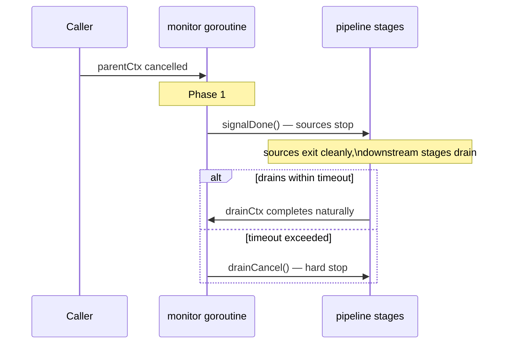

The key design decision is that stages run on **`drainCtx`**, an independent
context derived from `context.Background()`, not from `parentCtx`. Cancelling
`parentCtx` therefore does not directly stop any stage. Only two events can
cancel `drainCtx`:

1. The drain timeout fires (`drainCancel()` is called by the monitor).
2. A stage returns an error (the errgroup cancels `egCtx`).

The monitor goroutine lives **outside** the errgroup. If it were inside, a
normal pipeline completion would leave the monitor blocking on
`<-parentCtx.Done()` forever, and `eg.Wait()` would never return. The
`defer drainCancel()` in `runWithDrain` unblocks the monitor after
`eg.Wait()` returns, allowing a clean exit.

---

## Type erasure

All engine values are `any`. The public kitsune layer bridges in and out:

```go
// At the operator call site, the user's typed fn is wrapped:
wrapped := func(ctx context.Context, in any) (any, error) {
    return userFn(ctx, in.(I))  // type-assert on the way in
}

// At a Collect terminal, the output is unwrapped:
for item := range outCh {
    results = append(results, item.(T))  // type-assert on the way out
}
```

This keeps the entire engine free of type parameters. The `Fn any` field on
`Node` holds whichever of the concrete function signatures the dispatcher will
cast it to at run time. No reflection is used; every cast is to a concrete
function type known statically in the dispatcher.

The cost of this design is that type errors (e.g., passing the wrong kind of
node function) become panics at run time rather than compile errors. This is
acceptable because the only code that constructs nodes is the kitsune package
itself — user code never creates `engine.Node` directly.
