# Kitsune Internals

This document explains how Kitsune works under the hood: the data structures,
concurrency model, and runtime machinery that powers every pipeline. It is
aimed at contributors and at users who want a mental model deeper than the
public API.

---

## The big picture

A Kitsune pipeline is a **directed acyclic graph (DAG)** of processing stages.
That graph is assembled lazily during pipeline construction: no goroutines
start, no channels are allocated: and then materialised at a single point when
`Run` (or `Collect`) is called.

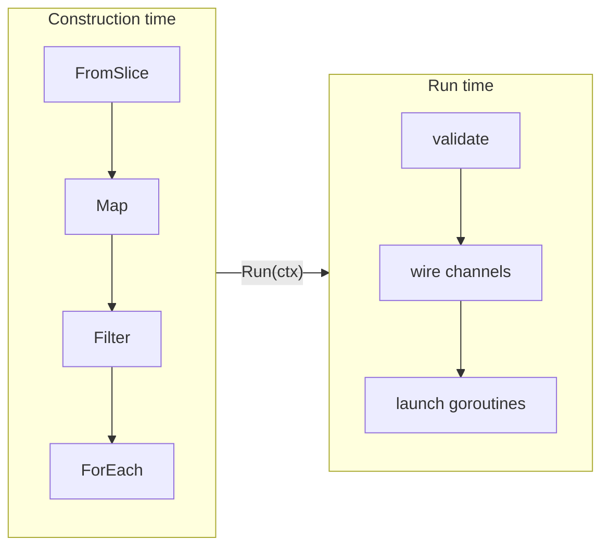

The public `kitsune` package is the runtime. Each operator constructs a typed
`*Pipeline[T]` carrying a `build` closure; no channels are allocated and no
type information is lost until `Run` is called. Generics are preserved
end-to-end: there is no type erasure in the hot path.

---

## Pipeline[T] and stageMeta

```
pipeline.go
```

**`Pipeline[T]`** is the core type: a lazy, reusable blueprint for one stage of
computation. It holds:

- `id int`: a process-unique stage ID (assigned at construction time via an
  atomic counter, `nextPipelineID`).
- `meta stageMeta`: static description of the stage (name, kind, inputs,
  concurrency, buffer size, …).
- `build func(*runCtx) chan T`: the closure that materialises the stage when
  `Run` is called. It recursively calls `build` on upstream pipelines, allocates
  a fresh typed channel, registers the stage's `stageFunc` into the `runCtx`,
  and returns the channel so downstream stages can read from it. The closure is
  memoised via `runCtx`: if this stage was already built in the current `Run`,
  the existing channel is returned immediately without re-registering: this is
  what makes diamond (shared-upstream) graphs safe.
- `fusionEntry func(*runCtx, func(ctx, T) error) stageFunc`: non-nil for
  fast-path-eligible `Map` and `Filter` stages (see Stage fusion below).
- `consumerCount atomic.Int32`: incremented at construction time by every
  operator that consumes this pipeline. `fusionEntry` is safe to use only when
  `consumerCount == 1`.

**`stageMeta`** holds introspection data for a single stage:

```go
stageMeta {
    id          int
    name        string
    kind        string         // "map", "filter", "source", "batch", …
    inputs      []int          // upstream stage IDs
    concurrency int
    buffer      int
    overflow    internal.Overflow
    batchSize   int
    timeout     time.Duration
    hasRetry    bool
    hasSuperv   bool
    getChanLen  func() int     // set during build; queries live channel length
    getChanCap  func() int     // set during build; queries channel capacity
}
```

**`runCtx`** is created fresh on every `Runner.Run` call. As `build` functions
are called recursively from the terminal back to sources, each stage registers
its `stageFunc` here and its output channel is memoised by stage ID:

```go
runCtx {
    stages []stageFunc         // goroutine bodies, one per stage
    metas  []stageMeta         // static descriptions, one per stage
    chans  map[int]any         // stage ID → typed channel (type-erased for storage)
    hook   internal.Hook
    refs   *refRegistry        // keyed state, populated during build phase
    done   chan struct{}        // closed by early-exit stages (Take, TakeWhile)
    // …cache, codec fields
}
```

`inputs []int` on `stageMeta` lists the upstream stage IDs this stage reads
from. It is almost always a single element; the exceptions are multi-input nodes
(`Zip`, `WithLatestFrom`, `Merge`). Multi-output nodes (`Partition`, `MapResult`)
are implemented as two independent `Pipeline` values that share the same build
closure and memoisation ID: the second call to `build` returns the already-
memoised channel immediately.

### Stage kind reference

The `kind` string on `stageMeta` is used for graph visualisation and hooks. Each
kind corresponds to a stage runner function:

| Kind string | Stage runner | Channels out |
|---|---|---|
| `"source"` | inline in source build closure | 1 |
| `"map"` | `runMapSingle` / `runMapConcurrent` / `runMapConcurrentOrdered` | 1 |
| `"flatmap"` | same variants as map | 1 |
| `"filter"` | `runFilter` | 1 |
| `"tap"` | part of Map fast path | 1 |
| `"take"` | `runTake` | 1 |
| `"takewhile"` | `runTakeWhile` | 1 |
| `"batch"` | `runBatch` | 1 |
| `"reduce"` | `runReduce` | 1 (emits once on close) |
| `"throttle"` | `runThrottle` | 1 |
| `"debounce"` | `runDebounce` | 1 |
| `"partition"` | `runPartition` | 2 (match / rest) |
| `"mapresult"` | `runMapResult` | 2 (ok / error) |
| `"broadcast"` | `runBroadcast` | N |
| `"merge"` | `runMerge` | 1 |
| `"zip"` | `runZip` | 1 |
| `"withlatestfrom"` | `runWithLatestFrom` | 1 |
| `"sink"` / `"foreach"` | `runSink` | 0 (terminal) |

---

## Channel wiring

```
internal/outbox.go: NewOutbox, NewBlockingOutbox
```

Channels are **not** allocated in a centralised pass. Instead, each operator's
`build` closure allocates its own typed output channel inline when called:

```go
// Inside Map's build closure:
ch := make(chan O, cfg.buffer)
rc.setChan(id, ch)   // memoised by stage ID for diamond-graph safety
```

The result is stored in `rc.chans map[int]any` keyed by stage ID. Downstream
stages retrieve their input channel by calling `rc.getChan(upstreamID)` and
type-asserting to the expected `chan T`.

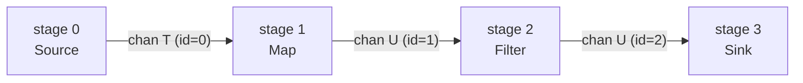

Multi-output stages (`Partition`, `MapResult`, `Broadcast`) are implemented as
two (or N) independent `Pipeline` values that share the same stage ID. The first
`build` call allocates the channel and registers the stage function; subsequent
calls hit the memoisation guard and return the existing channel:

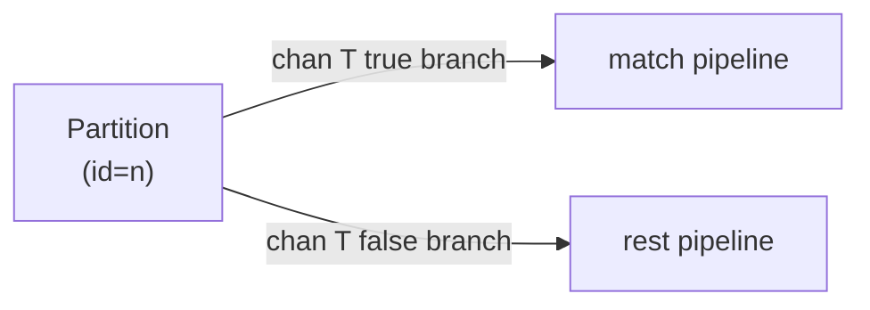

Each build closure wraps its raw channel in an `Outbox` (via
`internal.NewOutbox` or `internal.NewBlockingOutbox`) that enforces the overflow
strategy configured on that stage (see next section).

---

## Outboxes and overflow

```
internal/outbox.go
```

Every stage writes to its output through an `Outbox`, never to the raw channel
directly. The `Outbox` interface has two methods:

```go
Send(ctx context.Context, item any) error
Dropped() int64
```

This indirection is where the three overflow strategies diverge:

**Block (default)**: a simple `select` that sends the item or returns
`ctx.Err()` on cancellation. Zero overhead; no counters.

**DropNewest**: a non-blocking try-send. If the buffer is full the incoming
item is discarded immediately. An atomic counter records the drop and
`OverflowHook.OnDrop` is called if the hook implements it. No locks.

**DropOldest**: evicts the oldest buffered item to make room. The fast path
(buffer has space) is identical to Block. The slow path (buffer full) takes a
mutex, reads one item from the channel to free a slot, then writes the new item.
The mutex is held only during that eviction, so normal sends remain
contention-free.

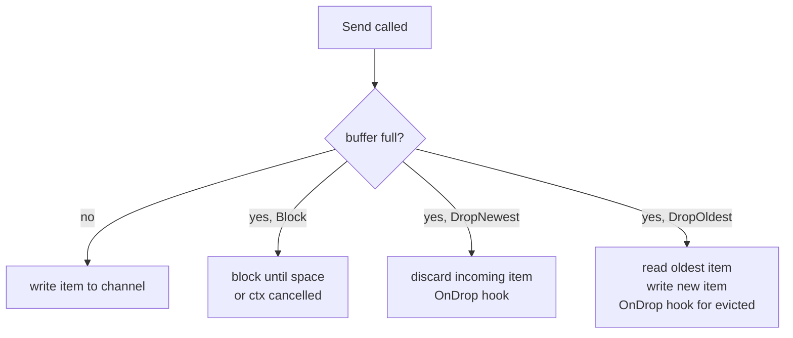

---

## How Run ties it all together

```
kitsune.go: Runner.Run
```

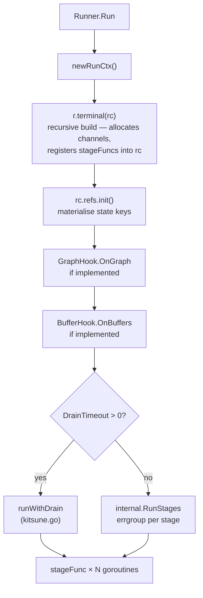

`r.terminal(rc)` starts the recursive build: the terminal stage calls `build`
on its upstream pipeline, which calls `build` on its upstream, and so on back
to the source. Each `build` closure allocates a typed channel and appends a
`stageFunc` to `rc.stages`. When the recursion unwinds, every stage is
registered and every channel is wired.

Each stage then runs in its own goroutine inside an `errgroup`. When any
goroutine returns a non-nil error the group's shared context (`egCtx`) is
cancelled, causing every other goroutine to see `ctx.Done()` on its next check
and exit.

Each `build` closure registers a stage goroutine that does two things before
entering its processing loop:

1. Defers closing its output channel(s) on exit: this is how downstream stages
   learn the stream is exhausted (`range inCh` terminates, or `ok == false`).
2. Wraps the processing function in `internal.Supervise` (see
   `internal/process.go`) if supervision is configured.

```go
// Conceptual shape of each build closure's registered stageFunc:
func(ctx context.Context) error {
    defer close(outCh)           // closes output channel(s) on exit
    return internal.Supervise(ctx, policy, hook, name, inner)
}
```

---

## The done channel: early exit without context cancellation

When `Take` or `TakeWhile` decides no more items are needed, it must signal
upstream sources to stop. Cancelling the shared context would prematurely abort
downstream stages that are still draining in-flight items.

Instead, a separate `done chan struct{}` (closed via a `sync.Once`) is used.
Sources check it on every yield:

```go
select {
case <-done:      return false  // stop producing — clean exit
case <-ctx.Done(): return false
default:
}
```

`runSource` goes a step further: it derives a `srcCtx` from the parent context
that is *also* cancelled when `done` fires, so source functions that block on
`<-ctx.Done()` (e.g. infinite generators) wake up correctly:

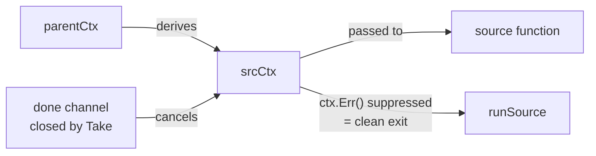

This means sources never need to know about `done` directly: they only see a
context that happens to cancel when the pipeline no longer needs them.

---

## Concurrency patterns inside a stage

### Single worker (default)

The inner loop is a straightforward `for { select { case item := <-inCh: … } }`.
No synchronisation beyond the channel itself.

### Concurrent unordered: `Concurrency(n)`

`runMapConcurrent` spawns `n` worker goroutines that all read from the same
input channel. The channel is Go's natural work queue: no extra synchronisation
needed for item distribution.

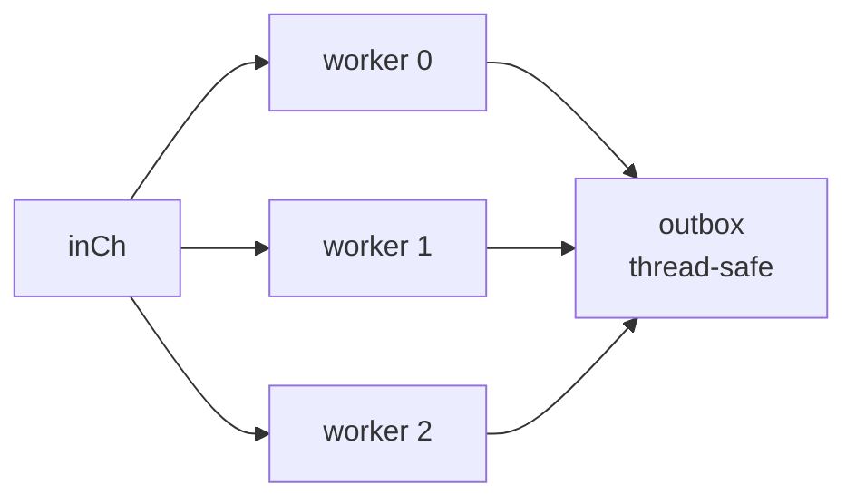

Error coordination uses an `errOnce`/`firstErr`/`innerCancel` triple: the first
worker to hit an error atomically records it, calls `innerCancel()` to stop
the others, and a `sync.WaitGroup` ensures the caller waits for all workers
before returning the error.

### Concurrent ordered: `Concurrency(n)` + `Ordered()`

`runMapConcurrentOrdered` preserves input order using a slot pipeline:

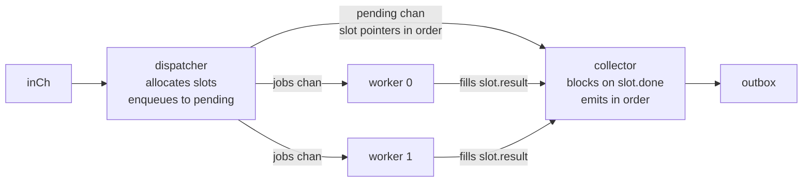

A *slot* is `{result any; err error; done chan struct{}}`. The dispatcher
creates one slot per item, sends the slot pointer to both `jobs` (for a worker
to fill) and `pending` (to maintain order). Workers run concurrently; the
collector always drains `pending` in arrival order, blocking on `<-slot.done`
before forwarding each result.

---

## Fan-out: Partition, MapResult, and Broadcast

**`runPartition`** evaluates a boolean predicate and routes each item to one
of two outboxes. Every item goes to exactly one branch (port 0 = true, port
1 = false).

**`runMapResult`** applies a transformation function and routes based on whether
it succeeded. Successful outputs go to port 0; items where the function returns
an error go to port 1, wrapped in an `ErrItem{Item, Err}` by the
`MapResultErrWrap` function stored on the node. Unlike regular `Map`, it never
invokes the `ErrorHandler`: every error is always routed, never halted or
retried.

Both `Partition` and `MapResult` follow the same shared-ID pattern in the build
closures and are treated identically in the `BufferHook` buffer-query closure.

**`runBroadcast`** sends every item to all N outboxes sequentially. Because the
sends are sequential, a slow consumer on one branch will backpressure the entire
broadcast. Size buffers generously on broadcast branches when consumers run at
different speeds.

All fan-out nodes close all of their output channels on exit, cascading
shutdown down every branch.

---

## Fan-in: Merge and Zip

**`runMerge`** spawns one goroutine per input channel. All goroutines write to
the same shared outbox:

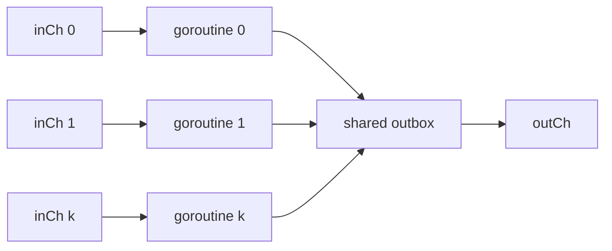

The output channel is closed once all input goroutines have exited. Errors use
the same `errOnce`/`innerCancel` coordination as concurrent map.

**`runZip`** reads from two input channels *sequentially*, not concurrently:

```go
for {
    a, ok := <-inCh1   // blocks until item or close
    b, ok := <-inCh2   // then blocks for the partner
    outbox.Send(ctx, convert(a, b))
}
```

The sequential read means: if `inCh1` is producing faster than `inCh2`, items
accumulate in `inCh1`'s buffer while `runZip` waits for `inCh2`. Buffer the
faster branch generously (`Buffer` option) when the two sources run at different
rates.

---

## WithLatestFrom

`runWithLatestFrom` maintains a mutex-protected "latest secondary value" that is
updated by a background goroutine, while the main loop combines primary items
with that value:

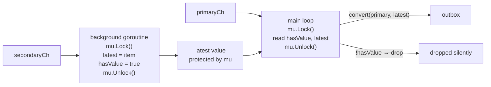

Primary items that arrive before the secondary has emitted a single value are
silently dropped: this matches RxJS semantics. The background goroutine exits
when `secondaryCh` is closed or `ctx` is cancelled.

**Independent-graph support**: `WithLatestFrom` (like `Merge` and `Zip`) works
with pipelines from separate graphs. When the two pipelines share a graph the
engine-native node is used; otherwise the secondary pipeline drains into a
mutex-protected `latest` value in a background goroutine while the primary is
forwarded through a channel: mirroring the engine implementation but at the
`Generate` layer. The `Partition` pattern is still useful when config updates
and primary events are multiplexed into the same source channel:

```go
cfgBranch, reqBranch := kitsune.Partition(src.Source(), func(e Event) bool {
    return e.IsConfig
})
combined := kitsune.WithLatestFrom(reqBranch, cfgBranch)
```

---

## Time-based stages: Throttle and Debounce

Both stages capture their duration directly in the build closure as a
`time.Duration` local variable.

**`runThrottle`** records the `lastEmit` timestamp. Each incoming item is
compared against the elapsed time: if `now - lastEmit >= d`, the item is emitted
and `lastEmit` is updated; otherwise the item is dropped. Items dropped this way
trigger `OverflowHook.OnDrop`.

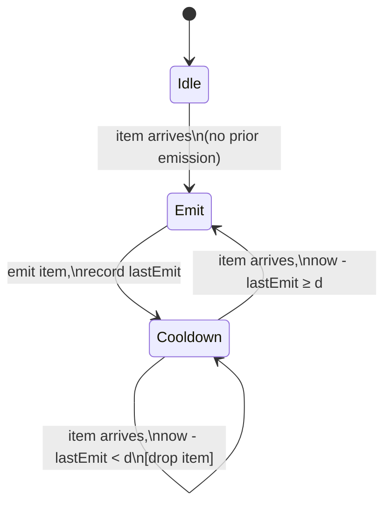

**`runDebounce`** keeps a single `pending` slot and a resettable `time.Timer`.
Each incoming item replaces `pending` and resets the timer. When the timer fires
with no new arrivals, `pending` is emitted. On input close, any remaining
`pending` item is flushed immediately.

The timer management is careful to drain `timer.C` after a `Stop()` that may
have already fired: a standard Go timer-reset pattern to avoid receiving a
stale tick on the next `select`.

---

## Reduce and Scan

**`runReduce`** accumulates into a single value using the seed value captured in
its build closure. It does *not* emit on every item; it only emits when the
input channel closes:

```go
acc := seed   // closed over from construction time
for item := range inCh { acc = fn(acc, item) }
outbox.Send(ctx, acc)  // emits once
```

This means `Reduce` always emits exactly one value: even on an empty stream
(it emits the seed).

**Scan** is implemented at the kitsune layer as a `Map` with a closure that
closes over an accumulator variable. It emits after *every* item rather than
waiting for close, so it is purely an operator-layer concept with no special
engine support.

---

## Batching

`runBatch` accumulates items in a typed slice and flushes when either the
size limit is reached or a timeout fires.

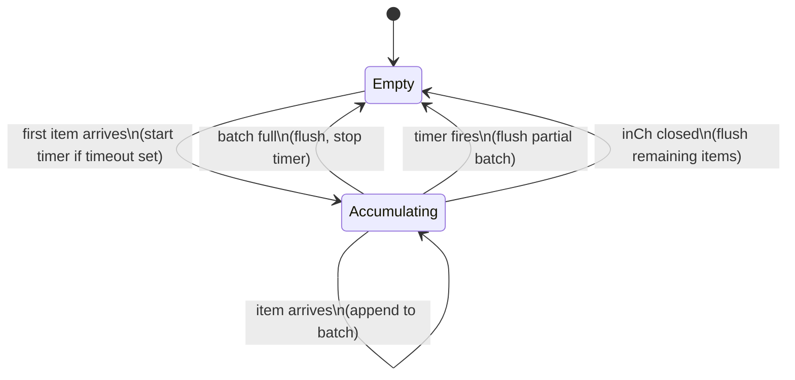

The timer is **off** when the batch is empty, **started** on the first item,
and **reset** after each flush. This ensures a partial batch always drains
within `timeout` of its first item regardless of upstream throughput.

The final flush on channel close is what makes graceful drain work for batch
stages: once upstream sources stop and their channels close, any partial batch
is emitted rather than silently discarded.

---

## Cache integration

When a `Map` stage uses `CacheBy`, the construction-time code stores a
`cacheWrapFn`: a factory that produces a cache-wrapped replacement for the
stage function. The factory is not invoked at construction time; it is deferred
to `build` time so it can receive runner-level defaults (`WithCache`) from `rc`.

Inside the `Map` `build` closure, the cache wrapper is resolved before the
`stageFunc` is registered:

```go
fn := userFn
if cfg.cacheWrapFn != nil {
    fn = cfg.cacheWrapFn(rc.cache, rc.cacheTTL)
}
// fn is now closed over by the stageFunc registered into rc
```

Because `Pipeline[T]` build closures are called fresh on every `Runner.Run`, the
resolved function is scoped to a single run: there is no shared mutable state
that could be corrupted across repeated runs.

The `Timeout` StageOption wraps the user function at *construction* time (before
the `cacheWrapFn` factory is built), ensuring both the direct call path and any
cache-miss path get the per-item deadline:

```
construction time:   userFn → timeout-wrapped fn → cacheWrapFn factory (closes over it)
build time (Run):    factory invoked → cache-wrapped fn
                     cache miss path calls the timeout-wrapped inner fn
```

---

## State management

`runCtx` carries a `refRegistry` for pipeline-level state (`pipeline.go`):

- **`inits`**: `map[string]func(Store, Codec) any`: registered during the build
  phase by `MapWith`/`FlatMapWith` build closures. Associates a key name with a
  factory that creates a `*Ref[T]` given the store backend and codec.
- **`vals`**: `map[string]any`: populated by `rc.refs.init(store, codec)` at
  run time. Each factory is called once, producing the concrete `*Ref[T]` that
  stages share.

Stage functions that use `MapWith`/`FlatMapWith` close over `rc.refs.get(name)`
— they receive the materialised ref from `vals`, not the factory. This means the
same pipeline definition can be run against different store backends simply by
passing a different `WithStore(s)` run option.

---

## Supervision

```
internal/process.go: Supervise
```

`internal.Supervise` is a **zero-cost abstraction** when inactive
(`MaxRestarts == 0 && OnPanic == PanicPropagate`): it calls the stage function
directly and returns, with no overhead.

When active, it wraps each execution in `runProtected`: a `defer recover()`
guard: and loops up to `MaxRestarts` times:

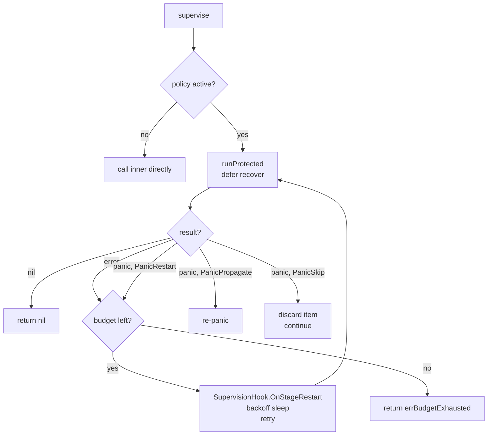

The `Window` field resets the restart counter after a quiet period, preventing
a stage with occasional hiccups from eventually exhausting its budget.

---

## Observability hooks

The hook system uses **optional interface extension**: a single base `Hook`
with several opt-in extensions checked via type assertion at run time. This
means existing `Hook` implementations never need to be updated when new
extension points are added.

| Interface | When called | Use case |
|---|---|---|
| `Hook` (base) | Stage start/stop, per-item | Metrics, logging |
| `OverflowHook` | Item dropped by overflow strategy or Throttle | Drop counters |
| `SupervisionHook` | Stage restarted after error or panic | Alerting |
| `SampleHook` | ~every 10th successful item | Value-level tracing |
| `GraphHook` | Once before execution, with full DAG snapshot | Topology export |
| `BufferHook` | Once before execution, with a channel-fill query fn | Backpressure dashboards |

**`GraphHook.OnGraph`** receives a `[]GraphNode` snapshot of the compiled graph —
node IDs, kinds, inputs, concurrency, buffer sizes. This fires before any stage
starts, making it useful for registering metric labels or rendering a static
topology view.

**`BufferHook.OnBuffers`** receives a `func() []BufferStatus` closure. The
closure captures the live channel map and returns `{Stage, Length, Capacity}`
for every non-sink node when called. The hook implementation calls this closure
periodically (e.g. every 250 ms) to track fill levels over time. The `kotel`
tail uses this to register an OTel `Int64ObservableGauge` with a
`metric.WithInt64Callback` so the OTel SDK pulls fresh buffer readings on each
collection interval.

---

## Graceful drain

```
kitsune.go: runWithDrain
```

When `WithDrain(timeout)` is set, `Run` uses a two-phase shutdown:

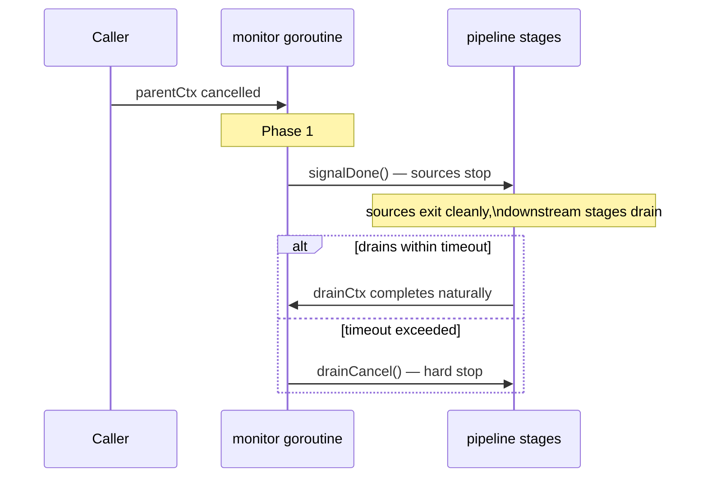

The key design decision is that stages run on **`drainCtx`**, an independent
context derived from `context.Background()`, not from `parentCtx`. Cancelling
`parentCtx` therefore does not directly stop any stage. Only two events can
cancel `drainCtx`:

1. The drain timeout fires (`drainCancel()` is called by the monitor).
2. A stage returns an error (the errgroup cancels `egCtx`).

The monitor goroutine lives **outside** the errgroup. If it were inside, a
normal pipeline completion would leave the monitor blocking on
`<-parentCtx.Done()` forever, and `eg.Wait()` would never return. The
`defer drainCancel()` in `runWithDrain` unblocks the monitor after
`eg.Wait()` returns, allowing a clean exit.

---

## Type safety

The current engine is **fully typed end-to-end**. `Pipeline[T]` carries the
item type as a Go type parameter; every channel is a concrete `chan T`; every
stage function closes over typed values directly. There is no `any` in the hot
path and no type assertions at item-processing time.

The only place `any` appears is in `runCtx.chans map[int]any`, which stores
channels type-erased for storage. Each build closure performs a single
type-assertion when retrieving its input channel:

```go
inCh := rc.getChan(upstreamID).(chan I)
```

This assertion happens once per stage per `Run`, not per item. It is safe
because the only code that sets a channel in `rc.chans` is the build closure for
that specific stage: the type is always correct by construction.

`rc.refs.vals map[string]any` similarly stores `*Ref[T]` values type-erased.
Again, the retrieval is a one-time assertion scoped to the build phase.

The practical effect is that type errors surface as compile errors at the API
level (wrong `fn` signature passed to `Map`), not as panics at run time.
